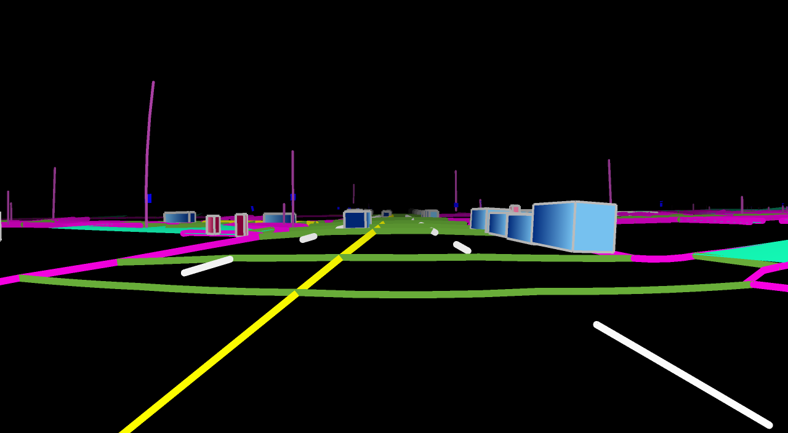

# Omniverse Dreams

NVIDIA Omniverse Dreams is a world model that generates multi-camera photorealistic
video for autonomous-driving simulation in real time.

The model consumes:

- A single input frame
- Initial text prompt
- Per-frame coarse HD map image (below) and trajectory poses

  

It produces photorealistic video frames in chunks. For example:


## How the pieces fit together

An OmniDreams rollout starts from one real RGB frame. That frame anchors the
appearance of the scene. The text prompt describes the driving context, while
the per-frame HD map image and trajectory poses provide the structured
conditioning for each generated chunk. The world model autoregressively
generates the next video chunk, then feeds that chunk back into the next step
so the scene can continue over time.

`samples/interactive-drive` wraps that inference loop in a live driving demo:
keyboard or wheel input updates the ego trajectory, the HD map renderer
produces the next conditioning frames, and the FlashDreams OmniDreams recipe
runs the video model. `samples/post-training` is separate from the live demo
and contains the fine-tuning launchers and configs.

This repository contains the following samples for demonstration:

- **[`samples/interactive-drive`](samples/interactive-drive/README.md)** - an interactive
  driving simulation with a live generated driving view that responds to
  keyboard input for exploring model behavior
- **[`samples/post-training`](samples/post-training/README.md)** - launchers
  and configs for fine-tuning the Cosmos2 SV-HDMap world model on a single
  8-GPU node or a Slurm cluster (student-init, bidirectional teacher, and
  self-forcing distillation). See
  [`samples/post-training/QUICKSTART.md`](samples/post-training/QUICKSTART.md)
  for the four-step out-of-box flow.

For offline, reproducible batch `mp4` video generation, see the companion
[`flashdreams`](https://github.com/NVIDIA/flashdreams) project. The
`samples/interactive-drive` `world-model` extra pulls `flashdreams` in
as a git dependency via `uv sync`; you do not need to clone it separately.

## Prerequisites

### Hardware and disk

| Workflow | Tested / expected hardware | Disk guidance |
|---|---|---|
| `interactive-drive` world-model demo | H100 80 GB, RTX 6000 Pro Blackwell Max-Q, and GB300-class systems. Use an 80 GB class GPU for the H100-validated path. | Plan for model and scene caches outside the repo. First setup downloads the scene data and a ~14 GB text encoder; selected FlashDreams checkpoints are cached separately. |
| Post-training | Supported minimum is a single 8-GPU Ampere/Hopper node (`NPROC=8`). Smaller `NPROC` values are unsupported. | At least 150 GB free; 200 GB or more is recommended for caches plus training output. |

Use a recent NVIDIA driver compatible with the CUDA stack in the selected
workflow. The post-training quickstart was validated with driver 570.148.08
and CUDA 12.8 on 8x H100 80 GB HBM3.

### Hugging Face access

The sample relies on Hugging Face scene assets on first run. The dataset you
will need is:

- [`nvidia/omni-dreams-scenes`](https://huggingface.co/datasets/nvidia/omni-dreams-scenes) — scene USDZ files

To allow automated download, create a Hugging Face token at https://huggingface.co/settings/tokens/new.

```bash
export HF_TOKEN=<YOUR-HF-TOKEN>    # used for the Hugging Face scenes dataset
```

If any download fails with `401`, `403`, or a gated-repo error, verify both the
token and the repo access above before debugging anything else.

If your environment uses another authorized Hugging Face org, set
`OMNI_DREAMS_HF_ORG=<YOUR-HF-ORG>` once in your shell. Post-training setup and
checkpoint loading use it to derive the OmniDreams model and scene repos.
Interactive-drive entry points also accept `--hf-org <YOUR-HF-ORG>`; the CLI
flag wins when both are set.

### GitHub access

`interactive-drive` pulls the FlashDreams OmniDreams integration through `uv`.
The documented Docker path assumes SSH access to `NVIDIA/flashdreams`; see
[`samples/interactive-drive/README.md`](samples/interactive-drive/README.md)
for SSH setup and HTTPS/PAT alternatives.

## Plain inference

For a non-interactive inference run, use the FlashDreams OmniDreams runner
instead of `interactive-drive`. The inputs are the same pieces described above:
an initial RGB frame, a text prompt, and HD-map / trajectory conditioning
frames. The output is a reproducible `mp4` sequence rather than a live browser
or Vulkan window. Start from the FlashDreams OmniDreams model page when you
want batch generation, and start from this repo when you want the live demo or
post-training.

## Quickstart: interactive-drive (interactive demo)

Prerequisites:

- Linux host with an NVIDIA GPU + recent driver. H100 80 GB, RTX 6000 Pro
  Blackwell Max-Q, and GB300-class systems have been used for validation.
- Docker + `nvidia-container-toolkit`
- A running SSH agent in the shell you'll launch `docker run` from, with
  a key loaded that has read access to
  [`nv-tlabs/omni-dreams`](https://github.com/nv-tlabs/omni-dreams) and
  [`NVIDIA/flashdreams`](https://github.com/NVIDIA/flashdreams). Verify
  with `ssh-add -l`, it should list your key if the agent is running.
  `$SSH_AUTH_SOCK` is forwarded into the container so the in-container
  `uv sync` reuses the same agent.
- GitHub PAT with `read:packages` for `ghcr.io/nvidia/flashdreams`
- `HF_TOKEN` from above

Pull and set up the container:
```bash
echo "$GITHUB_PAT" | docker login ghcr.io -u <github-username> --password-stdin
docker pull ghcr.io/nvidia/flashdreams:base-v0.3-20260430-7985764

mkdir -p ~/.ssh
ssh-keyscan github.com >> ~/.ssh/known_hosts
```

Clone the omni-dreams repo and run the container from there:
```bash
git clone git@github.com:nv-tlabs/omni-dreams.git
cd omni-dreams

docker run --rm -it \
  --gpus all --ipc=host --network=host \
  -v "$PWD":/workspace/omni-dreams \
  -v "$SSH_AUTH_SOCK":/ssh-agent \
  -v "$HOME/.ssh/known_hosts":/root/.ssh/known_hosts:ro \
  -v "$HOME/.cache/huggingface":/root/.cache/huggingface \
  -w /workspace/omni-dreams/samples/interactive-drive \
  -e NVIDIA_DRIVER_CAPABILITIES=all \
  -e SSH_AUTH_SOCK=/ssh-agent \
  -e HF_TOKEN="$HF_TOKEN" \
  -e HF_HOME=/root/.cache/huggingface \
  -e UV_PROJECT_ENVIRONMENT=/root/.venv \
  -v /run/user/$(id -u)/wayland-0:/run/user/0/wayland-0:rw \
  --device /dev/dri \
  -e WAYLAND_DISPLAY=wayland-0 \
  -e XDG_RUNTIME_DIR=/run/user/0 \
  -e SDL_VIDEODRIVER=wayland \
  ghcr.io/nvidia/flashdreams:base-v0.3-20260430-7985764 \
  bash
```

Install EGL inside the container:
```bash
apt-get update && apt-get install -y --no-install-recommends \
    libegl-dev libgl-dev && \
mkdir -p /usr/share/glvnd/egl_vendor.d && \
cat > /usr/share/glvnd/egl_vendor.d/10_nvidia.json <<'EOF'
{
    "file_format_version": "1.0.0",
    "ICD": { "library_path": "libEGL_nvidia.so.0" }
}
EOF
```

Sync and stage the assets:
```bash
uv sync --extra ui --extra world-model
uv run python prepare.py --scene-uuid clipgt-01d503d4-449b-46fc-8d78-9085e70d3554
```

If `prepare.py` fails with `PermissionError` on `~/.cache/huggingface/**/.lock`,
the host cache is owned by a different uid (often from a previous container
run); fix it with `sudo chown -R $(id -u):$(id -g) ~/.cache/huggingface`.

Use `--stream-mjpeg` when the host has no graphics-capable GPU (e.g. a
GB300-only DGX Station) or when you want to drive the demo from another
machine on the same network. Otherwise use the local-window variant below.

Web demo (view from any browser on the same network):
```bash
uv run --extra ui --extra world-model interactive-drive \
  --scene assets/scenes/clipgt-01d503d4-449b-46fc-8d78-9085e70d3554.usdz \
  --backend world_model \
  --manifest configs/example_world_model.yaml \
  --stream-mjpeg :8080
```

Local demo (Vulkan window from the container):
```bash
uv run --extra ui --extra world-model interactive-drive \
  --scene assets/scenes/clipgt-01d503d4-449b-46fc-8d78-9085e70d3554.usdz \
  --backend world_model \
  --manifest configs/example_world_model.yaml
```

Open `http://<host-ip>:8080/` in a browser on the same network. WASD /
arrows drive, `1` / `2` switch between the generated world-model RGB and
the rasterized HD map view, `R` restarts from the scene's starting pose,
`Esc` quits.

See [`samples/interactive-drive/README.md`](samples/interactive-drive/README.md)
for the native host toolchain path, additional run modes (HUD with
steering-wheel overlay, synthetic scene), keyboard controls, and
development tooling.

## Quickstart: post-training (fine-tune)

For fine-tuning the Cosmos2 SV-HDMap world model on a single 8-GPU node
(student-init, bidirectional teacher, or self-forcing distillation), see
[`samples/post-training/QUICKSTART.md`](samples/post-training/QUICKSTART.md).
It covers HuggingFace auth setup, checkpoint + sample-dataset staging, and
the launcher invocations for all three experiments. Slurm wrapper included
for multi-tenant clusters.

# License and Attribution

Omniverse Dreams is licensed under the [Apache License, Version 2.0](LICENSE).
Third-party runtime dependencies are fetched by package managers or companion
projects such as `flashdreams`.

- [`LICENSE`](LICENSE) — repository-wide Apache-2.0 grant
- [`CONTRIBUTING.md`](CONTRIBUTING.md) — DCO sign-off and PR conventions
- [`REUSE.toml`](REUSE.toml) — per-path / per-file license metadata
- [`THIRD_PARTY_NOTICES.txt`](./THIRD_PARTY_NOTICES.txt) — upstream
  attribution for vendored third-party code
- [`NOTICE`](./NOTICE) — third-party-fetch notice for runtime / install-time
  downloads
- [`samples/interactive-drive/NOTICE`](samples/interactive-drive/NOTICE) —
  inlining provenance for the `interactive-drive` sample
