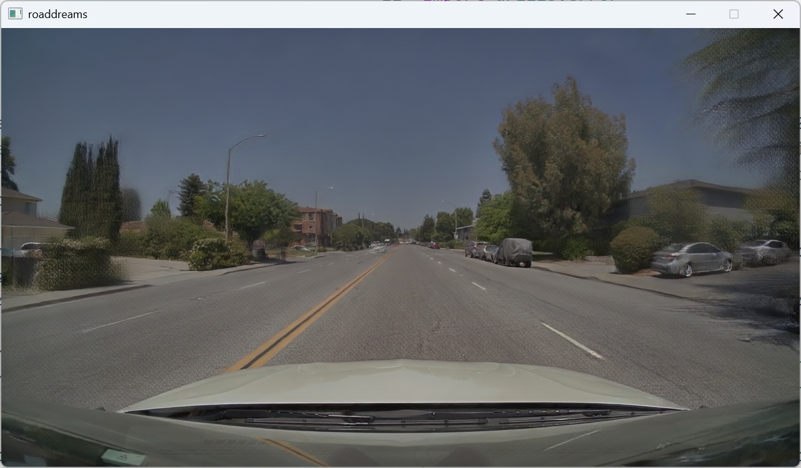

# interactive-drive

`interactive-drive` is an interactive demo for exploring Omniverse Dreams live.



Drive a single scene with the keyboard and switch between the two views that
matter most:

- the generated driving view from the world model
- the HD map view that conditions that generated output

This sample uses the flashdreams Alpadreams pipeline for world-model inference,
uses Ludus to render the HD map view, and uses SlangPy for local windowing.

Runs on Windows or Linux with a native host toolchain; the prebuilt Docker
image option is Linux-only.

The implementation is intentionally narrow:

- one scene loaded at startup
- one camera view
- ego-only kinematic controls from the keyboard
- one UI thread and one simulation thread
- explicit WSL-safe CPU staging between Vulkan and CUDA when needed

## Install

### 1. Prerequisites

**SSH access to private repos.** The `world-model` extra includes
`flashdreams` as a dependency, fetched from a private GitHub repo via SSH.
You must have an SSH key with read access to
[`nv-tlabs/omni-dreams`](https://github.com/nv-tlabs/omni-dreams) and
[`NVIDIA/flashdreams`](https://github.com/NVIDIA/flashdreams), loaded into
a running SSH agent (`ssh-add -l` should list it). If `ssh-add -l` reports
"could not open a connection to your authentication agent", start one with
`eval "$(ssh-agent -s)"` before loading your key.

Test with `ssh -T git@github.com`. If `uv sync` fails with "Permission
denied (publickey)", verify your SSH key setup. The Docker path below
forwards `$SSH_AUTH_SOCK` into the container so the same agent-loaded key
is used for the in-container `uv sync`.

If your GitHub access is token-based instead of SSH-based, configure git to
rewrite the FlashDreams SSH URL to HTTPS before running `uv sync`. Prefer a
credential helper or `.netrc` entry so the token is not written into global git
config. Repo-local `git config --local` rewrites may not be visible to `uv`
when it clones dependencies from a cache or temporary directory, so use an
environment-scoped rewrite for the `uv` command instead:

```bash
GIT_CONFIG_COUNT=2 \
GIT_CONFIG_KEY_0='url.https://github.com/.insteadOf' \
GIT_CONFIG_VALUE_0='ssh://git@github.com/' \
GIT_CONFIG_KEY_1='url.https://github.com/.insteadOf' \
GIT_CONFIG_VALUE_1='git@github.com:' \
uv sync
```

Then make sure your normal git credential flow can authenticate to
`https://github.com/NVIDIA/flashdreams.git`.

**Hugging Face token.** Scenes and the Cosmos-Reason1 text encoder are
downloaded from Hugging Face, so `HF_TOKEN` must be set in any shell where
you run `prepare.py` or `interactive-drive`. Create a token at
[`huggingface.co/settings/tokens/new`](https://huggingface.co/settings/tokens/new)
if you don't already have one, and request access to the
[`nvidia/omni-dreams-scenes`](https://huggingface.co/datasets/nvidia/omni-dreams-scenes)
dataset before the first run.

```bash
export HF_TOKEN=<your-hf-token>              # gates nvidia/omni-dreams-scenes
```

On Windows, set the same value as a user or session environment variable
named `HF_TOKEN` instead of using `export`.

If your environment uses another authorized Hugging Face org, pass
`--hf-org <YOUR-HF-ORG>` to `prepare.py` and `interactive-drive`, or set
`OMNI_DREAMS_HF_ORG=<YOUR-HF-ORG>` once in your shell. OmniDreams scene URLs
read from the world-model manifest are rewritten to the selected org;
unrelated upstream repos (`lightx2v/Autoencoders`, `nvidia/Cosmos-Reason1-7B`)
stay untouched.

### 2. Pick an environment

Pick **one** of the two paths below, then continue to step 3.

#### Option A — Native (host-installed toolchain)

The simplest path if you already have `uv`, a CUDA toolkit, and SDL/Vulkan
on the host (see the [root README](../../README.md) for the recommended
hardware and CUDA setup). No additional work in this step — just `cd` into
`samples/interactive-drive` and move on to step 3.

#### Option B — Docker (prebuilt `flashdreams` image)

If you'd rather skip installing CUDA, SDL, and the EGL toolchain on the host,
the prebuilt `flashdreams` image gives you an end-to-end Linux environment.
Additional prerequisites:

- Linux host (Wayland-based local windowing assumes Linux; Windows users
  should use the native path above)
- Docker + `nvidia-container-toolkit`
- GitHub PAT with `read:packages` for `ghcr.io/nvidia/flashdreams`
- `$SSH_AUTH_SOCK` set in your shell — the `docker run` below forwards that
  socket into the container so the SSH key from step 1 is reused for the
  in-container `uv sync`

1. **Pull the image.**

   ```bash
   echo "$GITHUB_PAT" | docker login ghcr.io -u <github-username> --password-stdin
   docker pull ghcr.io/nvidia/flashdreams:base-v0.3-20260430-7985764
   ```

2. **Pre-seed `known_hosts` on the host.** The container bind-mounts your
   host `~/.ssh/known_hosts` read-only, so it needs to already contain the
   git remotes `uv sync` will reach. Without this, the first `uv sync`
   inside the container will appear to hang at the `flashdreams` clone.

   ```bash
   mkdir -p ~/.ssh
   ssh-keyscan github.com >> ~/.ssh/known_hosts
   ```

3. **Launch the container** from the `omni-dreams` repo root:

   ```bash
   docker run --rm -it \
     --gpus all --ipc=host --network=host \
     -v "$PWD":/workspace/omni-dreams \
     -v "$SSH_AUTH_SOCK":/ssh-agent \
     -v "$HOME/.ssh/known_hosts":/root/.ssh/known_hosts:ro \
     -v "$HOME/.cache/huggingface":/root/.cache/huggingface \
     -w /workspace/omni-dreams/samples/interactive-drive \
     -e NVIDIA_DRIVER_CAPABILITIES=all \
     -e SSH_AUTH_SOCK=/ssh-agent \
     -e HF_TOKEN="$HF_TOKEN" \
     -e HF_HOME=/root/.cache/huggingface \
     -e UV_PROJECT_ENVIRONMENT=/root/.venv \
     -v /run/user/$(id -u)/wayland-0:/run/user/0/wayland-0:rw \
     --device /dev/dri \
     -e WAYLAND_DISPLAY=wayland-0 \
     -e XDG_RUNTIME_DIR=/run/user/0 \
     -e SDL_VIDEODRIVER=wayland \
     ghcr.io/nvidia/flashdreams:base-v0.3-20260430-7985764 \
     bash
   ```

4. **Install EGL inside the container.** The world-model backend renders
   frames via EGL on every run path — local Vulkan window, HUD, and the
   `--stream-mjpeg` HTTP stream — so this step is required regardless of
   how you plan to view the output:

   ```bash
   apt-get update && apt-get install -y --no-install-recommends \
       libegl-dev libgl-dev && \
   mkdir -p /usr/share/glvnd/egl_vendor.d && \
   cat > /usr/share/glvnd/egl_vendor.d/10_nvidia.json <<'EOF'
   {
       "file_format_version": "1.0.0",
       "ICD": { "library_path": "libEGL_nvidia.so.0" }
   }
   EOF
   ```

> [!TIP]
> If `uv sync` in step 3 below ever appears to hang, re-run it with `-vv` —
> the most common cause is an SSH host-key prompt for a remote that isn't
> yet in `known_hosts`.

### 3. Sync and stage assets

These two commands are the same for both paths. Run them from
`samples/interactive-drive` (or from inside the container, which already
puts you there).

```bash
uv sync --extra ui --extra world-model
uv run python prepare.py --scene-uuid clipgt-01d503d4-449b-46fc-8d78-9085e70d3554
```

`uv sync` installs the Python deps for both the local-windowing UI and the
world-model backend. `prepare.py` stages the requested scene USDZ from the
resolved scenes dataset (`nvidia/omni-dreams-scenes` by default, or another
authorized org when `OMNI_DREAMS_HF_ORG` / `--hf-org` points there) and
pre-warms the Cosmos-Reason1 text encoder used at runtime (~14 GB of
Hugging Face cache), so the first setup can take a while depending on your
network. Flashdreams owns video checkpoint selection and cache layout for the
selected recipe.

Common `prepare.py` flags:

- `--scene-uuid <clipgt-...>` — stage only one specific scene instead of
  all of them. Useful on bandwidth-constrained links (and a good first
  choice inside the container). Browse available UUIDs on the
  [scenes dataset page](https://huggingface.co/datasets/nvidia/omni-dreams-scenes/tree/main/scenes).
- `--skip-hf-prewarm` — skip pre-warming Hugging Face model repos;
  flashdreams will pull assets lazily on first use.
- `--skip-text-encoder` — skip the ~14 GB text-encoder prewarm when you're
  using a precomputed prompt embedding or want a lighter first-time setup.
- `--skip-scene` — don't stage any scene (for when you're supplying your
  own USDZ via `interactive-drive --scene`).

If `prepare.py` fails with `401`, `403`, or a gated-repo error, verify
`HF_TOKEN` and confirm access to `nvidia/omni-dreams-scenes`.

Once done, you should see this binary asset inside the workspace:

- `assets/scenes/<scene-uuid>.usdz`

Scene assets live under `assets/scenes/`; Hugging Face model snapshots live
in the normal Hugging Face cache. Flashdreams manages its own video
checkpoint locations.

### First-run behavior

The first world-model launch can spend several minutes in loading and
optimization before the view becomes interactive. In the browser stream this
shows up as `Loading world model...` followed by `Optimizing world model...`.
That phase includes checkpoint loading, torch compilation / CUDA graph setup,
and Triton autotuning. Subsequent runs are usually much faster because cached
kernels and model assets are reused.

During Triton autotuning you may see non-fatal messages such as
`Runtime error during autotuning: permute(sparse_coo)...`. Those indicate that
an autotuner candidate was rejected for the current tensor shape; the runtime
continues with a valid candidate.

## Run

There is one entry point — `interactive-drive` — and three modes selected by
flags:

| Mode | When to use | How |
|---|---|---|
| **HUD (default)** | You have a graphical desktop session and want the full demo: scene/variant selector, steering wheel + pedals overlay, BEV minimap, keyboard *and* wheel input. | `interactive-drive ...` |
| **Bare backend, local window** | You want the original lightweight setup: a single Vulkan window showing the world-model output, no HUD chrome. | `interactive-drive --no-hud ...` |
| **Bare backend, browser** | The demo machine has no local display, or you want to view from a laptop browser while the model runs elsewhere. Implies `--no-hud`. | `interactive-drive --stream-mjpeg HOST:PORT ...` |

The HUD itself uses pygame/SDL2 for rendering, which keeps the demo responsive
in fullscreen at high display resolutions (press `F11` to toggle). It supervises
the headless backend as a subprocess on `127.0.0.1:<--port>` so the world model
keeps running across scene / variant switches without restarting the entire
process.

### HUD mode (default)

```bash
uv run --extra ui --extra world-model interactive-drive \
  --scene assets/scenes/clipgt-01d503d4-449b-46fc-8d78-9085e70d3554.usdz \
  --backend world_model \
  --manifest configs/example_world_model.yaml \
  --wheel-profile auto
```

`--cuda-visible-devices` defaults to `auto`: on a multi-GPU machine (e.g. the
RTX6000 + GB300 dev box) the HUD sets `CUDA_VISIBLE_DEVICES=1` for the
backend so the GB300 hosts CUDA inference; on a single-GPU box it leaves the
env unset so the lone GPU is visible. Pass `--cuda-visible-devices 0` to pin a
specific GPU, or `--cuda-visible-devices ""` to forcibly clear the env.

Wheel profiles live in `configs/wheels/`; `auto` scans stable
`/dev/input/by-id` symlinks first, then `/dev/input/event*`, and matches the
detected device name against each YAML profile. If auto-detect ever picks the
wrong device, pass `--wheel-profile thrustmaster` or
`--wheel-device /dev/input/eventX`. The HUD also subscribes to the backend's
`/bev_stream` and shows a top-down BEV minimap below the steering and pedal
controls; pass `--no-bev` to skip the extra rasterizer dispatch when you don't
need it.

### `--no-hud`: bare backend, local Vulkan window

This is the lighter-weight path that matches the older standalone
`interactive-drive` script: a single Vulkan window for the world-model output,
no HUD chrome, no scene selector.

```bash
uv run --extra ui interactive-drive --no-hud \
  --scene assets/scenes/clipgt-01d503d4-449b-46fc-8d78-9085e70d3554.usdz \
  --backend raster
```

You should see the HD map view update as you drive the scene.

For the full world-model output:

```bash
uv run --extra ui --extra world-model interactive-drive --no-hud \
  --scene assets/scenes/clipgt-01d503d4-449b-46fc-8d78-9085e70d3554.usdz \
  --backend world_model \
  --manifest configs/example_world_model.yaml
```

You should initially see the generated driving view. Press `2` to switch to the
HD map view (conditioning input) and `1` to switch back to the photorealistic
output.

### `--stream-mjpeg`: bare backend served over HTTP

Use this when the demo machine has no local display, when you're connecting
over the network, or when you want to demo from a laptop browser while the
model runs elsewhere. Implies `--no-hud` because the user is then viewing
through a browser, not a local pygame window.

```bash
uv run --extra ui --extra world-model interactive-drive \
  --stream-mjpeg :8080 \
  --scene assets/scenes/clipgt-01d503d4-449b-46fc-8d78-9085e70d3554.usdz \
  --backend world_model \
  --manifest configs/example_world_model.yaml
```

Open `http://<host-ip>:8080/` in a browser on the same network; keyboard
events posted from the page are forwarded to the demo over the same socket.

On cloud GPU instances, the demo port may not be reachable directly from your
laptop. Forward the port and open the local forwarded URL instead. For Brev:

```bash
brev port-forward <instance> -p 8080:8080
```

Then open `http://localhost:8080/`.

Controls (apply in all three modes):

- `W` throttle
- `S` brake / reverse drag
- `A` steer left
- `D` steer right
- arrow keys mirror `W/A/S/D`
- `Space` stop
- `1` generated driving view
- `2` HD map view
- `R` reset rollout
- `Esc` quit

The browser control hint is static today, so it does not confirm every keydown
visually. If the world-model backend is still producing a chunk, input can be
accepted before the visual response arrives.

### Rollout drift and resets

OmniDreams generates video autoregressively, so long rollouts can accumulate
artifacts such as diagonal striping, color bleeding, or distorted geometry,
especially after extended driving without a reset. This does not necessarily
mean the demo is broken. Press `R` to restart from the scene's initial clean
state. For long demos, reset every 30-50 generated chunks or whenever visual
quality starts to drift.

### Without HD-map data (synthetic scene)

Use `--synthetic-scene` to skip the USDZ download entirely. interactive-drive
builds a procedural 2-lane road with a single intersection at startup and
feeds it to the same loader the regular flow uses:

```bash
uv run python prepare.py --skip-scene
uv run --extra ui --extra world-model interactive-drive \
  --synthetic-scene \
  --synthetic-initial-rgb path/to/forward_facing_road_photo.jpg \
  --backend world_model \
  --manifest configs/example_world_model.yaml
```

The world model is trained on natural driving frames, so passing your own
forward-facing road photo through `--synthetic-initial-rgb` makes the
generation start from a believable RGB instead of the scene_fixture's debug
gradient. Any aspect ratio works; the loader resizes to the raster
resolution. `--synthetic-prompt` similarly overrides the embedded text prompt.

The procedural road is a **20 km** golden track lined with periodic
streetlamp-style poles (~50 m spacing), parked cars on alternating
shoulders (~150 m spacing), and traffic signs on alternating shoulders
(~200 m spacing) so the scene doesn't look empty. The centerline is a
sum-of-sines so the road varies naturally instead of feeling like the
same kilometre on repeat. There's no per-session length knob -- the
track is generous enough that no demo realistically reaches the end.

## Develop

Two gates: a **fast** pre-commit hook (ruff + pyright, ~1–3s) and a **full**
check script that also runs pytest.

Install the pre-commit hook once, from the git repo root:

```bash
uv run --directory samples/interactive-drive pre-commit install \
    --config samples/interactive-drive/.pre-commit-config.yaml
```

Run the full check before pushing / opening a PR:

```bash
./scripts/check.sh          # ruff lint, ruff format --check, pyright, pytest
./scripts/check.sh --fix    # auto-fix ruff lint + format, then run the full check
```

The hook does not auto-fix. Use `./scripts/check.sh --fix` to clean up lint and
format issues explicitly.
